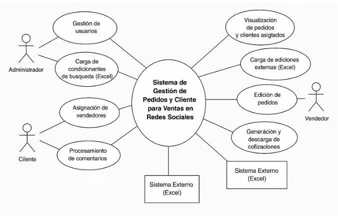
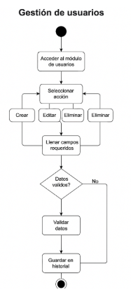
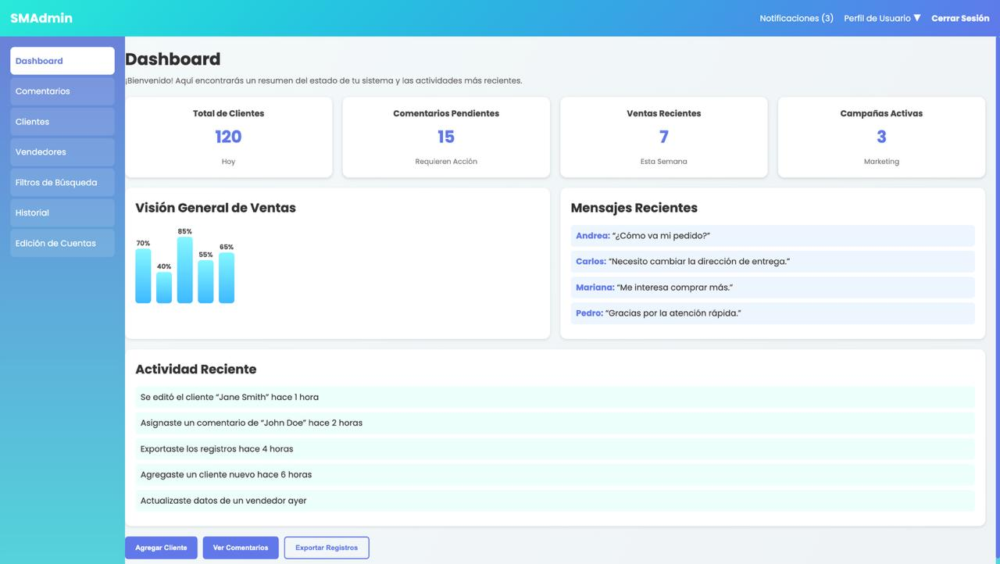
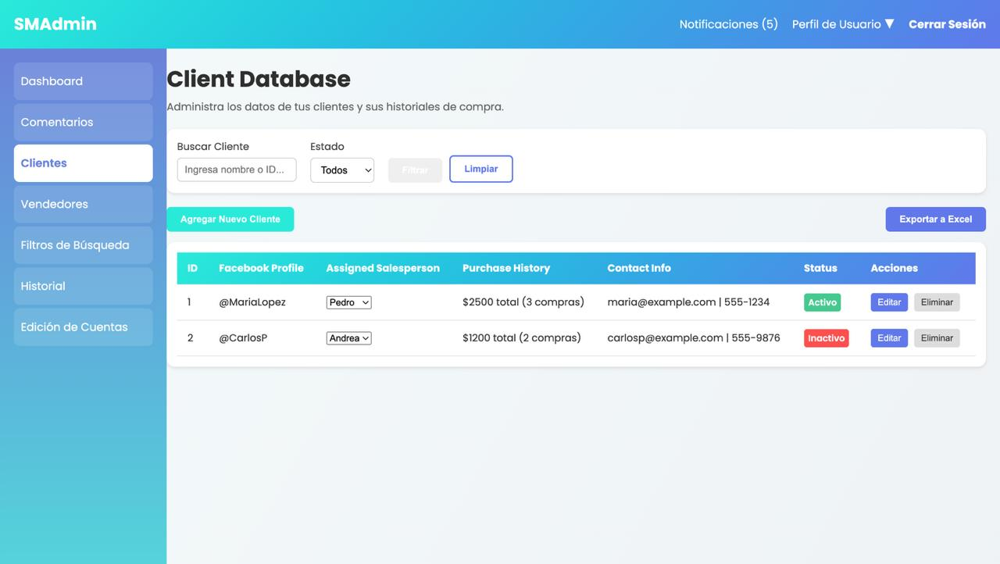
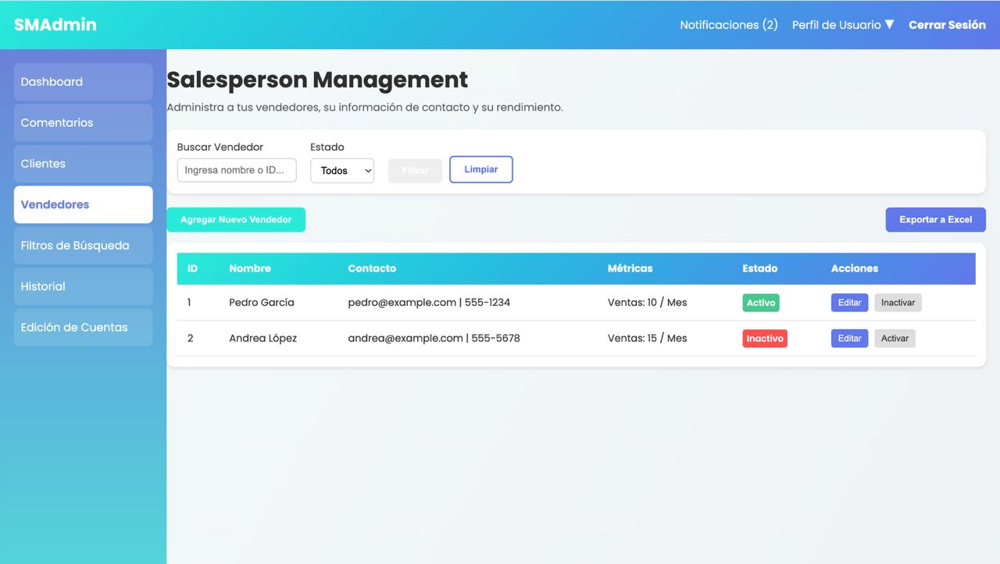
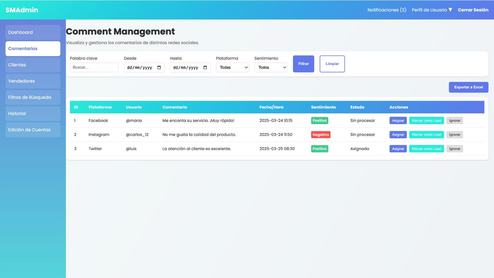
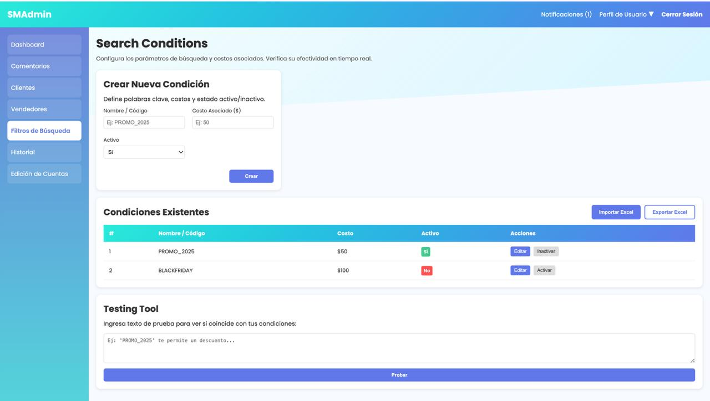
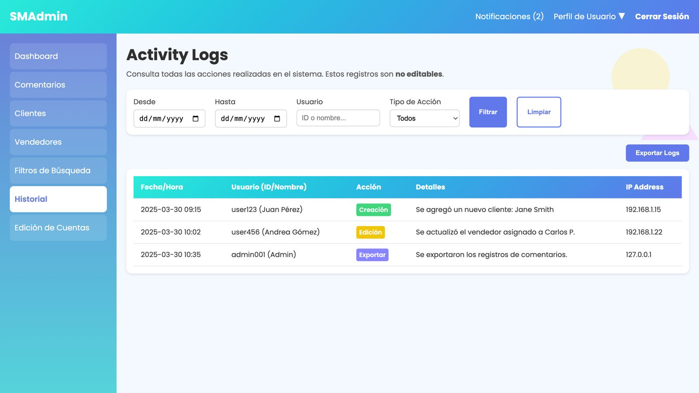
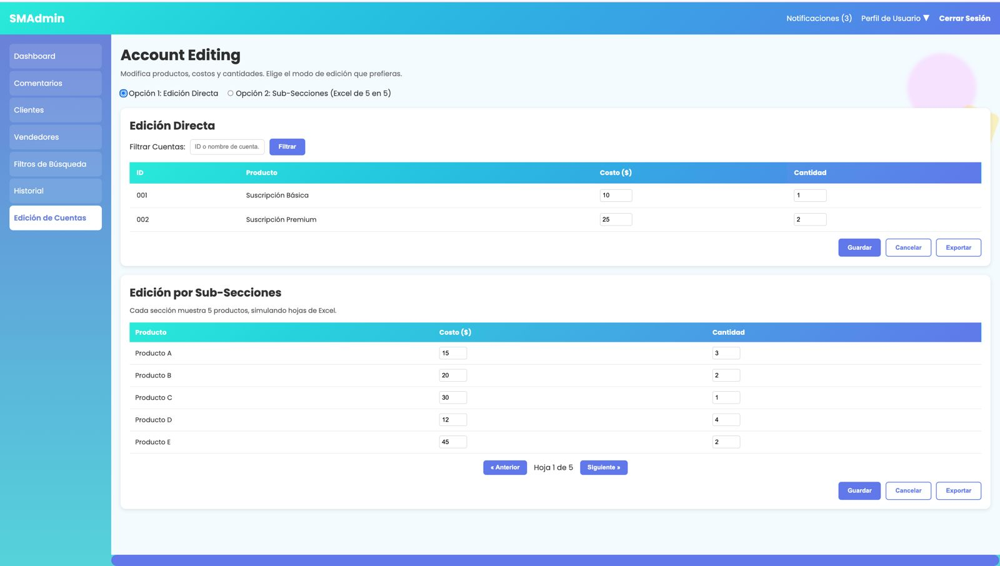

# OBD
https://docs.google.com/document/d/14DAHLcBMwYaiGtwhRbNzJSZ6TZcBDdfYWEKOUhshN60/edit?usp=sharing

# SMAdmin

**SMAdmin** es una solución administrativa diseñada para facilitar la gestión eficiente de pequeñas y medianas empresas (PyMEs). El sistema ofrece herramientas para controlar procesos clave como inventarios, clientes, ventas y reportes, con una interfaz intuitiva y centrada en la experiencia del usuario.

Este proyecto fue desarrollado como parte del curso de Ingeniería de Software por el equipo **OBD**, conformado por:

- **Aksel Deneken**  
- **Alex Styer**  
- **César Ignacio Saucedo**

Nuestro objetivo principal fue aplicar los principios de análisis y diseño de software para construir un sistema robusto, escalable y fácil de mantener, documentado de forma completa en la guía del proyecto incluida.

## 📊 Diagrama de Contexto

El siguiente diagrama muestra cómo interactúan los distintos actores con el **Sistema de Gestión de Pedidos y Clientes para Ventas en Redes Sociales (SMAdmin)**. Este sistema centraliza la información proveniente de redes sociales, clientes, vendedores y administradores, y facilita la gestión de pedidos, descuentos, reportes y análisis.

**Figura 1.** Diagrama de Contexto – desarrollado por César Ignacio Saucedo.

## ✅ Requisitos Funcionales

A continuación se listan los requisitos funcionales definidos para el sistema **SMAdmin**. Estos requisitos representan las capacidades clave que el sistema debe cumplir para satisfacer las necesidades organizacionales:

| ID    | Nombre del requisito funcional                | Descripción del requerimiento organizacional que cubre |
|-------|-----------------------------------------------|---------------------------------------------------------|
| RF01  | Gestión de usuarios                           | Permitir al administrador registrar, editar y eliminar usuarios con roles específicos (vendedor o administrador) para controlar el acceso y uso del sistema. |
| RF02  | Carga de condicionantes de búsqueda (Excel)   | Integrar al sistema los archivos de condicionantes que vinculan productos con palabras clave provenientes de redes sociales. |
| RF03  | Procesamiento de comentarios                  | Extraer, analizar y relacionar comentarios de redes sociales con productos registrados mediante los condicionantes de búsqueda. |
| RF04  | Identificación automática                     | Crear automáticamente un cliente con nombre de perfil e ID cuando se detecta interés en un producto desde redes sociales. |
| RF05  | Asignación de vendedores a clientes           | Permitir al administrador asignar un vendedor a cada cliente utilizando un panel desplegable. |
| RF06  | Carga de ediciones externas (Excel)           | Importar archivos Excel con ediciones realizadas fuera del sistema que deben impactar en los pedidos. |
| RF07  | Visualización de pedidos y clientes asignados | Permitir a los vendedores consultar en tiempo real a sus clientes y los pedidos correspondientes. |
| RF08  | Edición de pedidos                             | Permitir que los vendedores modifiquen pedidos: productos, cantidades y descuentos según lo autorizado. |
| RF09  | Generación y descarga de cotizaciones         | Generar documentos en PDF o Excel con el detalle del pedido, aplicando descuentos y mostrando el total final. |
| RF10  | Registro inalterable de modificaciones        | Registrar toda acción realizada sobre el sistema (ediciones, asignaciones, eliminaciones) con trazabilidad completa. |
| RF11  | Generación de reportes de ventas              | Producir reportes que incluyan: ventas por vendedor, pedidos por día, totales con y sin descuento. |
| RF12  | Validación y estructura de archivos Excel     | Validar la estructura y contenido de cada archivo Excel antes de ser procesado, rechazando los que no cumplan el formato requerido. |

## 🧩 Diagrama de Casos de Uso

El siguiente diagrama representa las principales interacciones entre los actores del sistema **SMAdmin** y sus funcionalidades clave. Se identifican los casos de uso necesarios para cubrir los requisitos funcionales del sistema de gestión de pedidos y clientes para ventas en redes sociales.

**Figura 2.** Diagrama de Casos de Uso – elaborado para representar la estructura funcional del sistema.

## 🧮 Tabla de Priorización de Requisitos Funcionales

La siguiente tabla muestra el análisis de priorización de los requisitos funcionales del sistema **SMAdmin**, considerando los criterios de valor, riesgo, complejidad y estabilidad. La prioridad global se establece con base en estos factores para facilitar la planeación del desarrollo.

| ID    | Nombre del requisito                                | Valor | Riesgo | Complejidad | Estabilidad | Prioridad Global |
|-------|------------------------------------------------------|-------|--------|-------------|-------------|------------------|
| RF01  | Gestión de usuarios                                  | Alta  | Baja   | Media       | Alta        | Alta             |
| RF02  | Carga de condicionantes de búsqueda (Excel)          | Alta  | Media  | Alta        | Media       | Alta             |
| RF03  | Procesamiento de comentarios                         | Alta  | Alta   | Alta        | Baja        | Alta             |
| RF04  | Identificación automática de clientes                | Alta  | Alta   | Alta        | Media       | Alta             |
| RF05  | Asignación de vendedores                             | Media | Baja   | Media       | Alta        | Media            |
| RF06  | Carga de ediciones externas (Excel)                  | Alta  | Media  | Media       | Media       | Alta             |
| RF07  | Visualización de pedidos/clientes asignados          | Alta  | Baja   | Media       | Alta        | Alta             |
| RF08  | Edición de pedidos                                   | Alta  | Alta   | Alta        | Media       | Alta             |
| RF09  | Generación y descarga de cotizaciones                | Alta  | Media  | Media       | Alta        | Alta             |
| RF10  | Registro inalterable de modificaciones               | Media | Baja   | Media       | Alta        | Media            |
| RF11  | Generación de reportes de ventas                     | Media | Media  | Baja        | Alta        | Media            |
| RF12  | Validación de archivos Excel                         | Alta  | Media  | Alta        | Alta        | Alta             |

## 📌 Casos de Uso de Alta Prioridad

### CU01 – Gestión de usuarios

**Nombre:** Gestión de usuarios  
**Actor principal:** Administrador  
**Descripción:** Permite crear, editar o eliminar usuarios, así como asignarles roles.  
**Precondición:** El administrador ha iniciado sesión.

#### 🔄 Flujo principal:

1. El administrador accede al módulo de usuarios.  
2. Selecciona la acción (crear, editar, eliminar).  
3. Llena los campos requeridos (nombre, correo, rol).  
4. El sistema valida los datos.  
5. Se guarda la acción en el historial.

#### 📈 Diagrama de Actividad:

**Figura 3.** Diagrama de actividad para el caso de uso "Gestión de usuarios".

#### ✅ Postcondición:
El usuario queda registrado, actualizado o eliminado.

#### ⚠️ Excepciones:

- Faltan campos requeridos  
- Formato de correo no válido  
- Rol inválido

---

### CU02 – Carga de condicionantes de búsqueda

**Actor principal:** Administrador  
**Descripción:** El sistema permite subir un archivo `.xlsx` que contiene las palabras clave para relacionar productos.

#### 🔄 Flujo principal:

1. El usuario entra al módulo de carga.  
2. Selecciona un archivo Excel válido.  
3. El sistema valida columnas esperadas.  
4. Se procesan las filas del archivo.  
5. Se muestra resumen de datos cargados.

#### ⚠️ Excepciones:

- Archivo con formato incorrecto → se rechaza.

---

### CU03 – Procesamiento de comentarios

**Actor principal:** Sistema  
**Descripción:** Analiza comentarios provenientes de redes sociales y los compara con las condicionantes para detectar interés en productos.

#### 🔄 Flujo principal:

1. Se importan comentarios desde redes sociales.  
2. El sistema analiza cada comentario.  
3. Se detectan coincidencias con palabras clave.  
4. Se registra la relación producto-cliente.

---

### CU04 – Identificación automática de clientes

**Actor principal:** Sistema  
**Descripción:** Al detectar un comentario relacionado con un producto, el sistema crea un nuevo cliente potencial.

#### 🔄 Flujo principal:

1. El sistema identifica perfil de Facebook del comentario.  
2. Genera ID único para el cliente.  
3. Asocia productos detectados.

---

### CU05 – Edición de pedidos

**Actor principal:** Vendedor  
**Descripción:** El vendedor accede al pedido de un cliente y modifica cantidades, productos o aplica descuentos.

#### 🔄 Flujo principal:

1. El vendedor entra a la sección de pedidos.  
2. Selecciona pedido del cliente.  
3. Edita cantidades o aplica descuento.  
4. El sistema valida límites.  
5. Guarda los cambios y actualiza historial.

---

### CU06 – Generación y descarga de cotizaciones

**Actor principal:** Vendedor  
**Descripción:** Genera una cotización en PDF o Excel con el detalle del pedido.

#### 🔄 Flujo principal:

1. El vendedor selecciona cliente.  
2. Confirma productos a incluir.  
3. Elige formato (PDF o Excel).  
4. El sistema genera archivo con subtotal, descuento y total.  
5. El archivo se descarga.

## 📚 Reglas de Negocio

A continuación se presentan las reglas de negocio que rigen el funcionamiento interno del sistema **SMAdmin**:

---

### 🛡️ RN01 – Control de Accesos
Solo los usuarios registrados con rol de **Administrador** podrán:
- Registrar nuevos usuarios  
- Asignar roles  
- Subir condicionantes de búsqueda  
- Asignar vendedores a clientes  
- Descargar reportes globales de ventas  

---

### 👤 RN02 – Roles del sistema
- El **Administrador** tiene acceso completo al sistema.  
- El **Vendedor** solo puede acceder a los clientes y pedidos que le han sido asignados.  

---

### 📥 RN03 – Validación de archivos
Los archivos `.xlsx` cargados deben cumplir con el formato predefinido, que incluye al menos:
- Número de pieza  
- Nombre del producto (código establecido)  
- Costo por pieza  
- Cantidad inicial, vendida y restante (si aplica)  

---

### 🤖 RN04 – Asignación automática de clientes
Cada vez que se identifica un comentario válido en redes sociales que coincide con una condicionante de búsqueda:
- Se generará un cliente nuevo automáticamente  
- Se le asignará un ID único  
- El cliente quedará “pendiente de asignación de vendedor”  

---

### 🔒 RN05 – Inmutabilidad del historial
Todas las modificaciones realizadas en el sistema deben registrarse en un historial que:
- No puede ser editado ni borrado  
- Incluye: usuario, fecha/hora, acción, entidad afectada, valores antes/después  

---

### 💸 RN06 – Aplicación de descuentos
Los descuentos aplicados a las cotizaciones **no podrán superar el 8% del total**, salvo autorización del administrador.

---

### 📄 RN07 – Generación de cotización
Una cotización solo se podrá generar si:
- El cliente tiene al menos 1 producto válido  
- Todos los productos tienen cantidad y precio unitario definidos  

---

### 🧮 RN08 – Cálculo de totales
El cálculo del total de una cotización debe considerar:

- **Subtotal** = SUMA(cantidad × precio_unitario)  
- **Descuento** = Subtotal × (porcentaje_descuento)  
- **Total** = Subtotal - Descuento  

---

### 📥 RN09 – Descarga de cotización
La cotización podrá ser descargada en formato **PDF** o **Excel**, y debe contener:
- Nombre del cliente  
- Productos seleccionados  
- Costo unitario  
- Cantidad  
- Descuento aplicado  
- Total  

---

### 📊 RN10 – Generación de reportes
Los reportes de ventas deberán incluir:
- Rango de fechas  
- Vendedor responsable  
- Total vendido  
- Número de pedidos realizados  

## 🧪 Bosquejo de la Aplicación

A continuación se muestran las vistas principales del sistema **SMAdmin**, diseñadas como parte del prototipo funcional. Estas pantallas reflejan los módulos claves del sistema, alineados con los casos de uso y reglas de negocio definidas.

### 🖥️ Dashboard principal

---

### 👥 Base de datos de clientes

---

### 🧑‍💼 Gestión de vendedores

---

### 💬 Comentarios de redes sociales

---

### 🔍 Filtro y coincidencias de productos

---

### 📜 Historial de modificaciones

---

### ⚙️ Edición de cuentas de usuario

## 📡 Plan de Comunicación – Equipo OBD

Con el fin de asegurar una colaboración efectiva, una coordinación clara y un flujo de trabajo fluido entre los miembros del equipo **OBD**, se establece el siguiente plan de comunicación:

---

### 1. Canales Principales

#### 🟢 WhatsApp (Canal principal)
- Vía principal de comunicación diaria.  
- Para mensajes rápidos, avisos, dudas operativas o coordinación inmediata.  
- Se espera que los mensajes sean claros y directos.  
- ⏱️ Tiempo de respuesta ideal: dentro de las siguientes 2 horas (en horario activo del equipo).

#### 🎥 Discord (Comunicación directa virtual)
- Utilizado para reuniones virtuales (videollamadas).  
- Ideal para toma de decisiones, resolución de dudas complejas o trabajo colaborativo en tiempo real.  
- Las reuniones serán acordadas con anticipación y se procurará respetar los horarios establecidos.

#### 🏫 Sesiones de clase (Comunicación presencial)
- Espacio clave para resolver dudas generales, compartir avances o coordinar tareas complejas.  
- También se usarán para reforzar acuerdos y evaluar el progreso del grupo.

---

### 2. Normas de Comunicación

- Mantener una comunicación **respetuosa, asertiva y colaborativa**.  
- Evitar mensajes innecesarios fuera de horario, salvo que sean urgentes.  
- Confirmar la recepción de mensajes importantes (emoji, texto corto o respuesta).  
- Ser **breves y precisos**, especialmente en WhatsApp.

---

### 3. Frecuencia y Coordinación

- 📆 **Actualización de avances:** al menos una vez por semana vía WhatsApp.  
- 📞 **Reuniones por Discord:** según necesidad o mínimo una vez por semana (día y hora por definir).  
- ✅ **Evaluación de tareas y pendientes:** durante sesiones de clase o al término de cada etapa clave del proyecto.

## 🧑‍💻 Guía de estilo de codificación

Para mantener coherencia dentro de nuestro código y nuestro trabajo implementaremos varias estrategias/normas dentro de nuestro código:

**Nombres:** Los nombres serán simples y fáciles de entender utilizando `lowerCameCase` para nombrar las cosas.  
**Indentación:** Mantener una indentación coherente que permite a cualquier persona leer el código y entenderlo.  
**Comentarios:** Se utilizarán comentarios donde sea necesario para ayudar tanto a los compañeros de equipo como a cualquier persona que lea el código.  
**Coherencia:** Lo más importante dentro de nuestro código para nosotros va ser la coherencia y lo fácil que es para entender.

---

## 🗓️ Plan de trabajo actualizado y aprendizaje adquirido

Nuestro plan de trabajo se enfoca en la eficiencia del proyecto y asegura que cada uno de los integrantes del equipo tenga un trabajo por completar para que se siga mejorando el proyecto. Estos son los pasos de nuestro plan de trabajo:

- Plan de comunicación  
- Análisis de requisitos y normas  
- Gestión de usuarios  
- Creación de el sitio ideal (Idea)  
- Creación del diseño del sitio  
- Creación del sitio (separando trabajos)  
- Reuniones frecuentes  
- Revisar el proyecto juntos

El aprendizaje adquirido que logramos es aprender la importancia de la comunicación y aprender cómo encontrar los requisitos dentro de un trabajo. La empresa solo nos presentó unos requisitos para su sitio, unas cosas que les gustaría implementar y cómo funciona su negocio. De esa información nuestro equipo lograra implementar un proyecto completo de un sitio capaz de ayudar a una empresa que apenas está creciendo para tener una plataforma personalizada y útil para su día a día. Actualmente hemos avanzado mucho en la creación del sitio destacando sus requisitos, modelando el sitio, modelando casos de usos y aprendiendo e implementando buenas prácticas de codificación.
