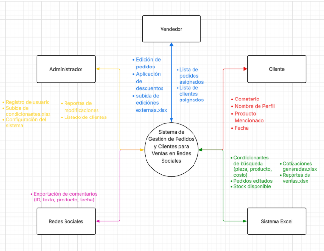

# OBD
https://docs.google.com/document/d/14DAHLcBMwYaiGtwhRbNzJSZ6TZcBDdfYWEKOUhshN60/edit?usp=sharing

# SMAdmin

**SMAdmin** es una solución administrativa diseñada para facilitar la gestión eficiente de pequeñas y medianas empresas (PyMEs). El sistema ofrece herramientas para controlar procesos clave como inventarios, clientes, ventas y reportes, con una interfaz intuitiva y centrada en la experiencia del usuario.

Este proyecto fue desarrollado como parte del curso de Ingeniería de Software por el equipo **OBD**, conformado por:

- **Aksel Deneken**  
- **Alex Styer**  
- **César Ignacio Saucedo**

Nuestro objetivo principal fue aplicar los principios de análisis y diseño de software para construir un sistema robusto, escalable y fácil de mantener, documentado de forma completa en la guía del proyecto incluida.

## 📊 Diagrama de Contexto

El siguiente diagrama muestra cómo interactúan los distintos actores con el **Sistema de Gestión de Pedidos y Clientes para Ventas en Redes Sociales (SMAdmin)**. Este sistema centraliza la información proveniente de redes sociales, clientes, vendedores y administradores, y facilita la gestión de pedidos, descuentos, reportes y análisis.

**Figura 1.** Diagrama de Contexto – desarrollado por César Ignacio Saucedo.

